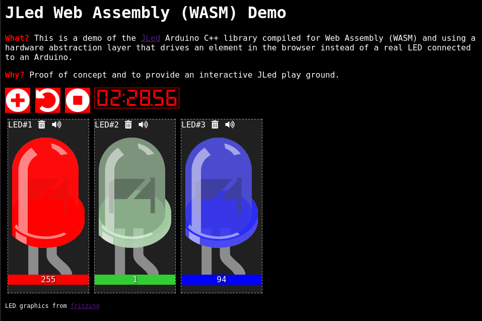

# JLed for the web

<!-- vim-markdown-toc GFM -->

* [Example](#example)
* [Author & License](#author--license)

<!-- vim-markdown-toc -->

[](https://jandelgado.github.io/jled-wasm)

This project compiles the embedded C++ JLed Arduino library to Web Assembly
(WASM), making it usable with Javascript. As an example an interactive
web-playground is provided. 

[JLed](https://github.com/jandelgado/jled) is an Ardunio C++ library to control LEDs in various ways.

How does it work? JLed is portable and has a simple hardware abstraction layer
(HAL). The HAL is implemented in Javascript an called from JLed code. The HAL
of the web demo displays some LED graphics in the browser, simulating the
typical output of LEDs connected to an Arduino.

[See the interactive Web demo here](https://jandelgado.github.io/jled-wasm)

## Example

Example on how to define and use a JLed HAL in Javascript:

```javascript
...
// create a HAL that prints the current value on the console
const out = new jled.JsAnalogWrite();
out.write = function(val) {
  const ts = Math.floor(Date.now());
  console.log(`${ts}ms: value is ${val}`);
};
const hal = new jled.JsHal(out);
const led =(new jled.JLed(hal)).DelayBefore(2000).Breathe(1000);
// update led ...
led.Update();
...
```

Run the [node-example.js](src/node-example.js) file for a complete example:

```shell
$ cd src && node example-simple.js
```

## Author & License

(c) 2020 Jan Delgado
License: MIT

